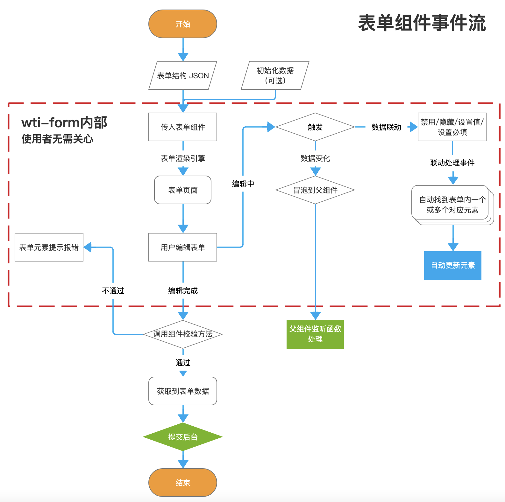
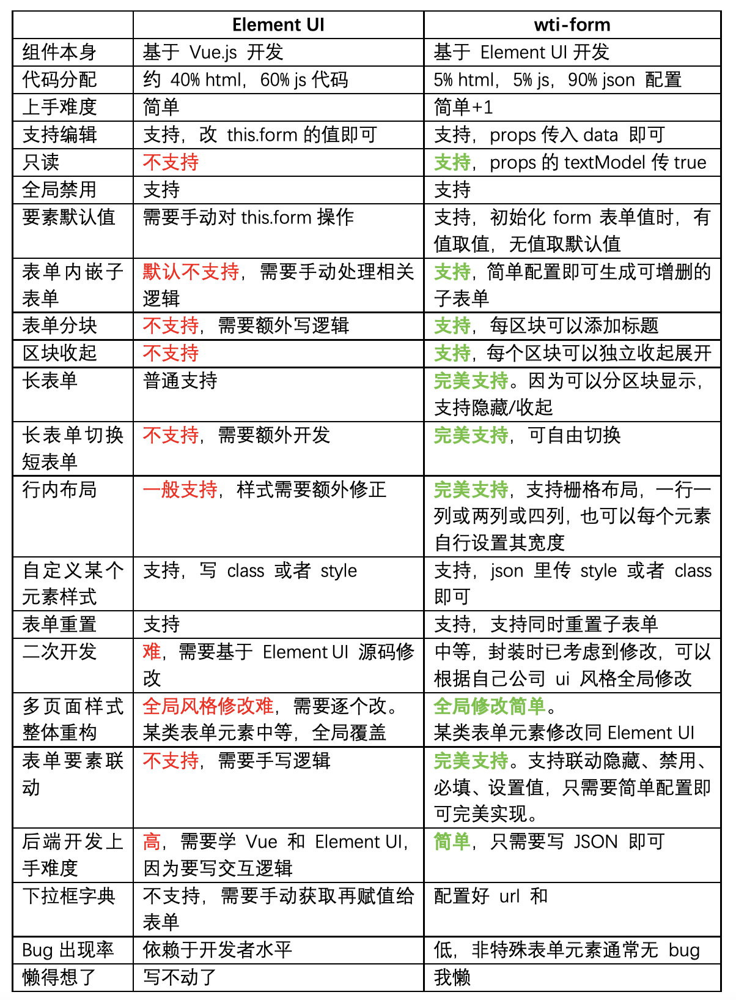
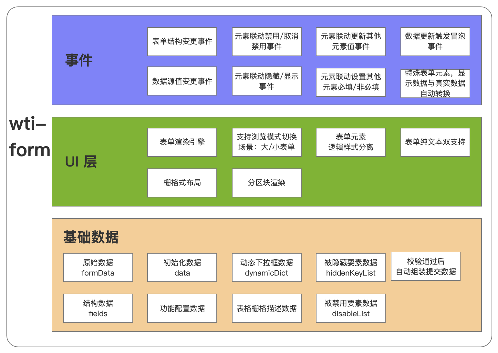

# 和 ElementUI 相比，提升1000%开发效率Vue表单组件

## 一、简介

> 作者：

零零水。曾写过多个 10w+，1w+博客。前阿里巴巴前端开发，现于某金融国企混，work life balance。擅长做一些提高效率的简单工作。

另，从来不当标题党。

> 描述

Vue.js 低代码表单组件，基于 Element UI 二次开发而成。命名为 wti-form

组件高度封装 js 逻辑的方式，是多表单页面场景的大杀器。

> wti-form 特点：

* 【不想写 html ？】基本不需要写 html，写写 json 配置就行；
* 【讨厌处理复杂场景的逻辑？】内置支持各种一般场景和常见复杂场景；
* 【同一个表单，代码要写 3 遍】？一套代码，可以通行【新增】、【编辑】、【查看】三种页面，降低 70% 开发量；
* 【交互太多，调试麻烦容易出出 bug？】表单内部的交互已内聚，解耦表单和外部的交互，降低开发工作量；
* 【想 cv 代码？】有详细的文档说明，并且每个后面都附代码，直接 cv 就能用；
* 【我是新手 ？】基于 Element UI 封装，支持大部分表单组件的原有属性；
* 【可靠否？】已在公司内部稳定使用半年，已基于其完成表单页数百个；
* 【需求太奇怪，无法满足？】二次开发极其简单，根据实际需求自主新增；
* 【那么能否不写代码？】文档里内置一个配置器，配置好后，自动生成 vue 文件，不需要写代码；
* 【公司穷，人少？】使用这个进行表单开发，人员费用支出预计减少 50%以上；

> 优点

wti-form 可以极大的提高开发效率（相对于 Element UI 来比)，预计最低提升效率 200%，最高提升效率 1000% 以上（相对于 Element UI 来比）。

我不和使用原生 Vue.js 来比，那样没意思。

并且可以支持通过网页配置，快速生成前端代码（一整个 Vue 文件）的功能（见文档）。

> 适用人群

* 表单页特别多，但人手/预算紧张的技术团队；
* 不擅长前端的后端开发者，但需要写前端表单页面（例如做私活）；
* 原本使用 Element UI ，但想减少重复工作量的开发者；
* 一线开发人员水平层次不齐，想要提高初中级开发的代码产出率、降低 bug 量的技术负责人；

> github 和文档地址：

* 组件源代码：<a href='https://github.com/qq20004604/wti-form'>https://github.com/qq20004604/wti-form</a>
* 文档源代码：<a href='https://github.com/qq20004604/wti-form-demo'>https://github.com/qq20004604/wti-form-demo</a>
* 文档地址：<a href='http://lovelovewall.com/wti_form_demo/home.html#/Install'>http://lovelovewall.com/wti_form_demo/home.html#/Install</a>

## 二、详细功能描述

wti-form 表单全局功能：

* 通过 json 数据来生成表单；
* 通过 data 数据给表单每个元素赋值；
* 支持表单校验；
* 表单支持分块显示；
* 支持单区块收起、展开、全部收起、全部展开；
* 支持将表单显示模式切换：长表单/带 tab 切换的短表单；
* 支持表单元素全局禁用（例如提交时）；
* 支持给表单加一个外框，增加区分度；
* 支持将表单模式切换为纯文本显示模式；
* 支持设置表单为一行四列/两列/一列；
* 二次开发自定义表单元素难度极低；
* 其他懒得写了；

wti-form 表单元素功能：

* 支持设置默认禁用、默认隐藏、默认值；
* 支持设置必填；
* 不同表单支持不同的校验规则，也可以自定义校验规则（同 Element UI）；
* 支持当某一个表单元素的值为指定值时，联动设置另一个表单元素的值/设置隐藏/设置禁用/设置必填；
* 支持自定义样式；
* 支持自定义 placeholder；
* 支持文本输入框、数字输入框、金额输入框、日期输入框、日期范围输入框、动态下拉框（自动请求数据字典）、普通下拉框、时间输入框、单选框、百分比输入框、文本域输入框等；
* 其他懒得写了；

附图 1：使用者用本组件开发时要做什么事情



也就是说，开发者一般来说只需要提供描述表单结构的 json，以及调用校验方法，就可以完成一个页面了。

如果需要初始化数据（比如说表单编辑页面），这个初始化数据和提交的数据结构是一模一样的。

有人可能会有疑问，这样的话，表单结构JSON 会不会很复杂？

当然不可能，具体可以参考文档这个页面：<a href="http://lovelovewall.com/wti_form_demo/home.html#/demo/Status">http://lovelovewall.com/wti_form_demo/home.html#/demo/Status</a>
，你可以在打开这个页面时，先试想一下自己实现这样的功能（各种联动、三个不同的表单再加交互功能），需要写多少行代码。

然后再看这个页面的源代码 <a href="https://github.com/qq20004604/wti-form-demo/blob/main/src/page/home/component/demo/status.vue">https://github.com/qq20004604/wti-form-demo/blob/main/src/page/home/component/demo/status.vue</a>

减少了至少 80~90% 的开发工作量，所以标题中的提高 1000% 效率，并未夸张，只是单纯陈述事实。

## 三、本组件和 Element UI 的表单组件进行对比

因为是基于 Element UI 二次开发的，因此，必然要比使用 Element UI 进行开发更方便，功能更强大，否则没有开发的价值。

因此，将本组件和 Element UI 进行对比，帮助你了解本组件的优势。

附图 2，图中对于核心点已经高亮




## 四、架构设计

先附源代码地址：<a href='https://github.com/qq20004604/wti-form/tree/main/package'>https://github.com/qq20004604/wti-form/tree/main/package</a>

再上一个架构分层图，附图 3：



结合图 2 和图 3，基本上可以描述清楚 wti-form 的大致设计了。

总的来说，wti-form 的架构可以这么来理解：

* 数据层：核心是【表单数据】和【配置数据】，而其他数据都是基于这 2 个动态计算出来的，并不会单独存储；
* UI 层：根据配置数据动态生成 ui，因此假如传入的配置变更，那么 ui 也会随着动态变化；
* 事件层：基于生成的 ui，用户进行操作，则将触发事件层。而事件层最终影响的是【表单数据】。

因此，整个组件，开发者只需要关心 2 个数据，以及基于数据衍生出来的 ui 和事件。因此并不存在同一个源数据但存储于多处导致可能的冲突和一致性，因此可以轻松写出高可靠度的代码。

而基于这样的设计，二次开发也是很简单的一件事情了。

但因为篇幅所限（才怪，是因为我懒），因此上图还缺少了这些：

* 子表单的事件流，以及父表单与子表单的交互方法；
* 表单与表单元素之间的关联设计；
* 基于个人需求，二次开发属于自己的内部组件的方法；

## 五、高度支持自动化测试

### 5.1 天生支持自动化测试

在测试一个表单页时，往往存在几个常见难题：

1. 表单太大，元素太多时：如果是手工测试，每次要填写很多表单项，非常浪费时间。如果是自动化测试，那么要一个一个抓表单元素，然后给里面填值，也非常浪费时间；
2. 表单太多：每个页面都要写一遍自动化测试逻辑，很浪费时间；
3. 表单元素变化：当表单要素变化时，要改自动化逻辑代码，也很浪费时间；

所以，在面对大量表单页场景时，往往测试复杂度最少也是 O(n²)，还很容易漏测。

针对这种情况，wti-form 对于支持自动化测试，则非常友好。

#### 5.1.1 表单元素定位

对于第一个问题，如果表单元素太多，我们需要一个快速定位每个元素的办法。

对于这种情况，提供了一个解决方案：用一个唯一 class 来定位。

具体来说，假如下面是一个输入框的 html

```
<div data-v-14c4e670="" data-v-74ae480c="" class="form-input-box form-item-box form-unqiue-name">
	<div data-v-14c4e670="" class="el-input el-input--suffix">
		<input type="text" autocomplete="off" placeholder="请输入用户名称" class="el-input__inner">
	</div>
</div>
```

那么，他必然有一个 class 是``form-unqiue-${key}``，这是通行所有元素的相同规则。


### 5.2 自动生成自动化测试代码


## 六、未来将添加的功能

表单本身功能架构设计，已经比较完善了，二次开发新增更多表单元素类型，也不难。

因此，从表单开始，打通整个开发环节，可以更有效的提高开发效率。

### 6.1 可视化生成表单

与 C 端场景不同，B 端场景更常见是处理流程。一个流程里会有很多表单，而在这些表单里会有很多相同的表单元素。这就意味着，这些表单元素可以大量复用。

因此我们可以开发一个后端服务，专门用来存储这些开发好的表单元素。

在开发一个新页面时，可以通过关键词搜索到之前写好的表单元素，然后通过勾选/拖拽的模式，直接拖入表单，最后直接生成一个Vue 组件甚至页面。这就是现在低代码平台最常见的使用方式了。

我们目前已经有这种方案的低配版，但是仍不够完美，并不能泛用到所有表单里。

因为低配版属于公司业务代码，因此无法直接给出来示例。不过文档里，给了一个【通过网页直接生成表单】的功能，属于低配版里的低配版，但也足够一般开发使用了。

<a href='http://lovelovewall.com/wti_form_demo/home.html#/demo/FastCreate'>http://lovelovewall.com/wti_form_demo/home.html#/demo/FastCreate</a>

### 6.2 打通产品经理与前端这条线

在 5.1 中，我们还是单纯只是前端代码层面的东西。但对于现代开发，我们完全可以有更多想象。

表单做成什么样子，是由产品经理定的。他们在把内容传达给我们时，是要先搞一个 excel，描述表单这里每个元素的具体规则。

所以，我们能不能做一个工具，直接打通产品经理与前端开发呢，我觉得是完全可以的。

简单设想一下，基于文档里提供的【快速创建表单】提供的工具，我们再拓展一下，允许配置表单元素的规则。然后再基于这个生成一个 excel，那么这就是产品经理的要素表。

同时，我们将这个数据存储到后端，然后前端可以基于这个，通过代码生成工具（文档里的 FastCreate 的功能），直接生成 Vue 文件。

于是，并没有增加产品经理的工作，甚至因为我们提供的工具，产品经理减少了他的工作量，也方便维护。

但同时，前端的工作量被大幅度减少了，前端只需要基于这个已经写好的 Vue 文件，二次开发一些特殊功能即可。

这就意味着，团队对于前端开发的需求量，也许可以减少 50%以上。这带来的都是研发成本的降低。

### 6.3 纵向拓展：自动生成后端代码

当我们打通产品经理和前端时，毫无疑问，也可以打通产品经理和后端开发这条线。

基于当前设计，我们将表单和元素解耦后，完全可以预知这个页面里，最后要提交给后台的数据是什么样子的。

换句话说，哪些元素必填、非必填、长度、类型，都是可以预知的。

而恰好，后端在表单校验时，也是需要这些东西来校验表单提交内容。因此，我们可以基于这个，直接生成后端的代码，可以减少许多后端开发工作量。

因为是自动生成的，所以当产品经理更新他的需求后（表单元素），后端可以通过工具再次生成，而无需手动维护。

更重要的是，通过这种方法生成的前后端代码，不会存在因为沟通问题，而导致字段校验规则不一致的情况。

毫无疑问，这也可以提高工程可靠性。

### 6.4 横向拓展：表格、图表的自动生成

一般来说，表单提交后，有时候需要通过表格、图表来预览。

所以在这种场景比较多的情况下，我们也可以基于稳定可靠的数据源，写一个自动生成图表、表格代码的工具。

甚至，可以复用这个 json 配置，然后写一个转换函数，自动生成表格/图表。

这个难度并不高。

## 七、总结

总而言之，wti-form，就使用难度、专业度、开发效率来说，完爆市面上大部分表单组件，并且不需要额外学习成本。

无论是接私活的后端开发者，成本有限人力不足天天加班的技术负责人，toB 场景需要写大量表单页面的中小软件开发企业，都是最佳选择。

